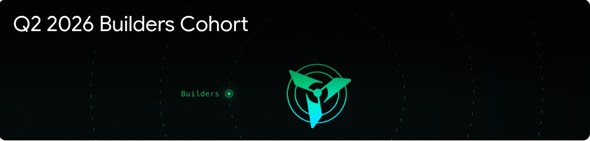
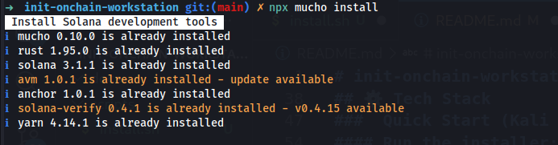
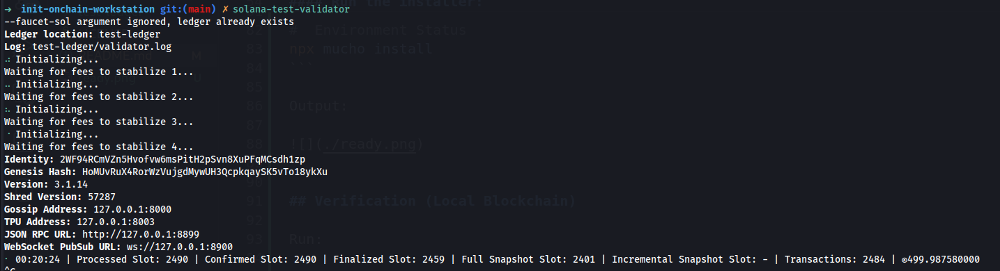

# init-onchain-workstation




>A battle-tested Solana development environment — built, debugged, and verified on Kali Linux


## Overview

This repository documents the complete setup of a Solana development environment, including:

- [x] System dependency installation
- [x] Rust toolchain setup
- [x] Solana & Anchor tooling
- [x] Debugging failed installs
- [x] Running a local validator

This is not a theoretical guide — it is a real, working environment verified through execution.

## ⚙️ Tech Stack
- [x] Solana CLI
- [x] Anchor Framework
- [x] Rust (via rustup)
- [x] AVM (Anchor Version Manager)
- [x] Mucho Installer
- [x] Yarn (via Corepack)
- [x] Kali Linux

###  Quick Start (Kali Linux)

Clone the repo:

git clone https://github.com/DecentralizeGeeky/init-onchain-workstation.git
cd init-onchain-workstation

#### Run the installer:

```bash
chmod +x scripts/install.sh
./scripts/install.sh

# Manual Setup (Step-by-Step)
# 1. Install System Dependencies

sudo apt update && sudo apt install -y \
build-essential pkg-config libudev-dev llvm \
libclang-dev protobuf-compiler libssl-dev curl

# 2. Fix Docker Source Conflict
sudo rm /etc/apt/sources.list.d/docker.sources

# 3. Install Rust
curl --proto '=https' --tlsv1.2 -sSf https://sh.rustup.rs | sh
source "$HOME/.cargo/env"

# 4. Fix Yarn Installation
npm install -g corepack
corepack enable
corepack prepare yarn@stable --activate

# 5. Install Solana Toolchain
npx mucho install

#  Environment Status
npx mucho install
```

Output:




## Verification (Local Blockchain)

Run:
```bash
solana-test-validator
```

Expected output includes:



- [x] Local validator running
- [x] Blockchain initialized
- [x] Ready for development

## Challenges & Fixes

### Issue	Resolution
- mucho install failed	Installed dependencies manually
- Docker source conflict	Removed conflicting source files
- Rust not installed	Installed via rustup
- Yarn not working	Fixed using Corepack
- Multiple install failures	Retried after stabilizing environment

📁 Project Structure
onchain-workstation/
├── README.md
├── scripts/
│   └── install.sh
├── docs/
│   └── setup-notes.md
└── .gitignore

## Kali Auto Setup Script

This project includes a custom script to automate setup:
```bash
chmod +x scripts/install.sh
./scripts/install.sh
```

The script handles:

- System dependencies
- Rust installation
- Yarn setup
- Solana toolchain installation
- Environment verification

🔐 Security
No private keys or wallet secrets included
No .env files exposed
Safe for public sharing

## Next Steps

Build first Anchor program
Deploy to local validator
Test on Solana Devnet
Develop real on-chain applications

# Author

Muhammad Adamu

GitHub: [Geek](https://github.com/DecentralizeGeeky)
x: [Geek](https://x.com/Adamsgeeky)

## ⚡ Final Note

This is not just an environment setup.

This is proof of execution under failure — the ability to break, fix, and ship a working system


